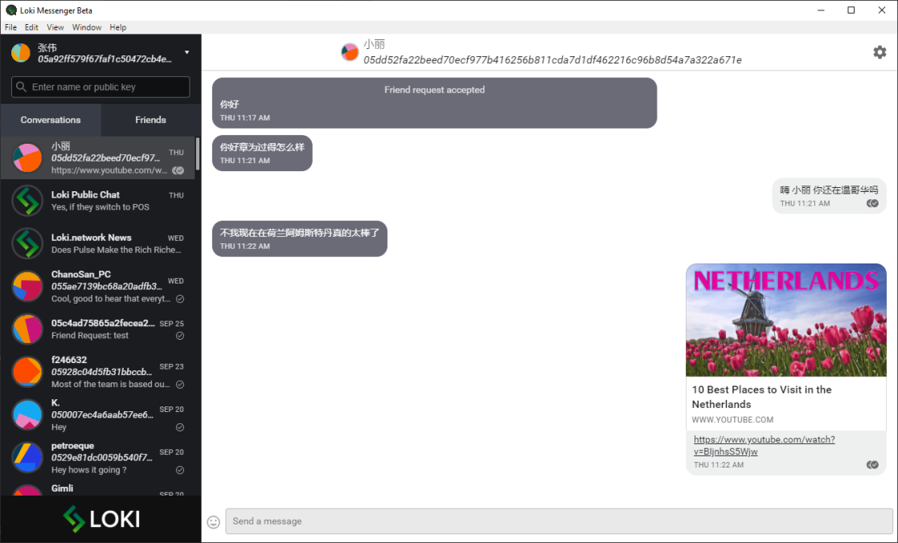

md<link rel="stylesheet" type="text/css" href="https://www.loki.network/asciinema-player.css" />
<h2>介绍</h2>

	

		

  			

				隐私拥有决定你何时披露个人信息的代理性质。如今，当个人数据的收集和存储正以史无前例的水平进行时，质量尤其有价值。
				  
				Loki利用区块链去中心化的技术来创建与互联网交互的新方式，保证了交易和通信的隐私和匿名性。
			

		

 		<h2>下载链接</h2>
  		

  			

  				<h3>信使</h3>
  				

   	  				<a href="https://github.com/loki-project/loki-messenger/releases" class="button button-outline">桌面系统</a>
    			

    			

   	 				<a href="https://github.com/loki-project/loki-messenger-android/releases" class="button button-outline">安卓系统</a>
   				

    			

   	  				<a href="https://github.com/loki-project/loki-messenger-ios/releases" class="button button-outline">苹果系统</a>
    			

    			<h3>钱包</h3>
    			

      				<a href="https://github.com/loki-project/loki-electron-gui-wallet/releases" class="button button-outline">图形界面</a>
    			

    			

   	  				<a href="https://github.com/loki-project/loki/releases" class="button button-outline">命令行钱包</a>
    			

    			

   	  				<a href="https://github.com/loki-project/loki-android-wallet/releases" class="button button-outline">安卓系统</a>
    			

    			

   	  				<a href="https://github.com/loki-project/loki-ios-wallet/releases" class="button button-outline">苹果系统</a>
    			

			

			

    			<h3>洛基网络</h3>
    			

   	  				<a href="https://github.com/loki-project/loki-network/releases" class="button button-outline">桌面系统</a>
    			

  			

		

	

	

		
  	

	<video width="1000" poster="assets/AssetsChina/thumbnail.PNG" controls>
    <source src="assets/AssetsChina/ChinaThisIsLokiHardSubs.webm"  type="video/webm">
    	Your browser does not support the video tag.
	</video>

 

## 什么是loki？
Loki是一个允许用户在互联网上进行私密交易和通信的匿名隐私网络，它提供一套工具来最大程度的保持在线网页浏览，交易和通信时匿名性。  

借助区块链技术的去中心化，Loki创建了与互联网交互的新的私有和安全的方法，并构建了以隐私为中心的应用程序，例如消息服务，论坛，在线市场和社交媒体平台。

	

		<h3>信使</h3>
		

			
		

		

			Loki Messenger是适用于所有平台的去中心化私人消息传递应用程序。 匿名和无懈可击的消息传递应用程序让您高枕无忧。
		

	

	

		<h3>服务节点</h3>
		

			
		

		

			服务节点是Loki网络的核心，并通过其贡献获得可观的经济回报。 使用服务节点，您可以实现托管服务，运行SNApp和浏览Lokinet。再让互联网变得更加私密的过程中获得盈利。 
			  
			<a href="https://github.com/loki-project/loki-docs/blob/master/docs/ServiceNodes/SNFullGuide.md"> 查看服务节点指南以托管您自己的服务节点。</a>
		

	
	
	

		<h3>洛基网络</h3>
		

			
		

		

			独特的Lokinet由区块链强制实施和激励的洋葱路由网络，您可以在其中匿名浏览互联网，访问和托管私人网站，而无需暴露您的身份或IP地址。 
			  
			<a href="https://github.com/loki-project/loki-docs/blob/master/docs/Lokinet/LokinetOverview.md">查看Lokinet概述以了解更多信息。</a>
		

	

	

		<h3>服务节点应用程序</h3>
		

			
		

		

			SNApps（服务节点应用程序）允许在Lokinet内托管隐藏的私有Web应用程序。 借助SNApp，您可以建立反审查的社交媒体平台，新闻站点，市场和其他社区，这种可能性是无止境的。
			  
			<a href="https://github.com/loki-project/loki-docs/blob/master/docs/Lokinet/Guides/PublicTestingGuide.md">查看公共测试指南以托管自己的SNApp。</a>
		

	
		

	
 
 

## 信使

	

		

			Loki Messenger不会像其他Messenger那样连接到中央服务器，而是连接到协作服务节点组（“集群”），它们在存储消息的同时实现了高度冗余，即使在离线时也避免了消息的丢失。
			  
			Loki Messenger提供了一种新的在线通信方式，可确保用户的最佳性能和安全性，同时为连接区块链技术和Loki Messenger传送解决方案提供了可靠的使用案例。
			  
		

		
	

	

		
	

 
 

## 服务节点

	

		

			Loki的大部分网络功能和延展性是由一组称为服务节点的激励节点来实现的。 为了操作服务节点，运营商会定时锁定大量的Loki，并为网络提供最小级别的带宽和存储。 作为其服务的回报，Loki服务节点运营商将从每个区块中获得一部分区块奖励。
			  
			这样的网络可提供基于市场的Sybil攻击抵御能力，从而解决了现有混合网和以隐私为中心的服务所带来的一系列问题。 这种抵制基于供求互动关系，有助于防止单个参与者在Loki中拥有过大的股份，从而对Loki提供的第二层隐私服务产生巨大负面影响。 DASH首先提出了可以从加密经济学推论Sybil抗攻击网络的理论。 当进攻者购买Loki，现存流通供应减少，反而施加需求侧压力，推动Loki的价格上涨。 随着这种情况的继续，额外Loki的购买变得越来越昂贵，这使攻击变得非常昂贵。
			  
			为了实现这种经济保护，loki鼓励积极抑制现存的流通供应。特别是曲线发行和附加要求必须设计为确保足够的流通供应被锁定，并为节点运营商提供合理的回报，以确保抵御Sybil的攻击。
		

	

	

		 
	

 
 

## 洛基网络

	

		

			通过Lokinet传输的所有数据都是经过加密的，并通过隐藏真实来源的多个节点进行跳转。
您的真实IP地址不会泄露给Loki网络地址网络。在Loki网络中使用Loki硬币提供了可选择的升级，但Loki网络的的核心功能是免费的。
			  
			Lokinet中的路由不依赖于任何单一服务器，从而使其具有抵御攻击的能力，并且互联网服务提供商无法阻止您在Lokinet上访问您的网站。与VPN不同，您不需要依赖单一服务器，因为Lokinet使用洋葱路由网络。
			  
			支持Windows、Linux和Mac平台上的任何主流浏览器。
		

	

	

		 
	

 
 

##  服务节点应用程序

	

		

			SNApps的功能类似于Tor中发展的所谓隐藏服务。 它们为用户提供了一种在混合网络环境中进行完全交互的方式，从而提供了比访问外部主管内容更高的匿名度。 SNApps允许用户在自己的机器或服务器上建立和托管市场，论坛，举报网站，社交媒体和大多数其他互联网应用程序，同时保持全服务器和用户端的匿名。 这极大地扩展了网络范围，并允许用户在Loki网络中建立重要的社区。
			  
			SNApp运营商使用传统的服务器-客户端模型，主要区别在于服务节点将成为通过洛基网络与用户连接的中介。 当SNApp希望在网络上注册时，它必须使用其描述符更新DHT。 此描述符包含各种导入器，这些导入器是用户可以联系以形成SNApp路径的特定服务节点。 设置这些路径后，用户可以连接到SNApp，而无需任何一方知道对方在网络中的位置。
		

	

	

		 
	

